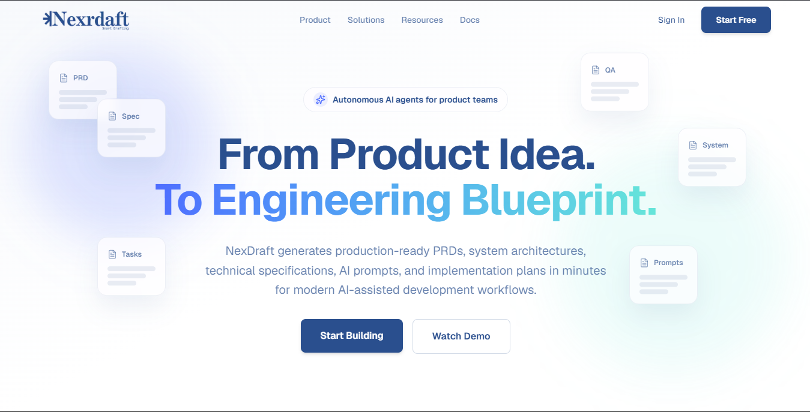

<div align="center">

# NexDraft

**Turn a startup idea into a production-ready engineering blueprint — powered by autonomous AI agents.**

[](https://nex-draft.vercel.app/)
[](https://nextjs.org)
[](https://www.typescriptlang.org)
[](https://tailwindcss.com)
[](https://supabase.com)
[](#license)

</div>

---

## Live Demo

<a href="https://nex-draft.vercel.app/" target="_blank" rel="noopener noreferrer">
  
</a>

**[Open the live demo at https://nex-draft.vercel.app/](https://nex-draft.vercel.app/)**

_Click the screenshot above (or the link) to launch the app._

---

## What is NexDraft?

NexDraft is an AI-assisted product engineering workspace. You describe your idea —
target users, goals, and constraints — and NexDraft's autonomous agents turn it into a
complete engineering package: PRDs, system architecture, technical specifications, and
implementation plans.

Instead of writing documentation from scratch, you start from a structured, agent-driven
blueprint that is ready to hand to an engineering team.

### Features

- **Guided project intake** — a multi-step flow that captures target users, goals, and constraints
- **Agentic generation** — autonomous agents produce PRDs, architecture diagrams, and specs
- **Documentation suite** — Markdown-driven docs renderer with code blocks and SDK examples
- **Project dashboard** — real project and profile data read straight from the database
- **Analytics & activity** — usage insights and a chronological activity feed
- **Marketing pages** — product showcase, solutions, resources, and pricing
- **Auth & onboarding** — Google/OAuth sign-in via Supabase with a guided onboarding flow
- **Subscriptions** — Free / Pro / Enterprise plans with feature gating and quota limits
- **Route protection** — server-side middleware guards dashboard, projects, settings, and onboarding

---

## Tech Stack

| Layer | Technology |
| --- | --- |
| Framework | [Next.js 16](https://nextjs.org) (App Router, React Server Components) |
| Language | [TypeScript 5](https://www.typescriptlang.org) |
| Styling | [Tailwind CSS 4](https://tailwindcss.com) |
| Auth & Database | [Supabase](https://supabase.com) (`@supabase/ssr`, `@supabase/supabase-js`) |
| Animation | [Framer Motion](https://www.framermotion.org) |
| Icons | [Lucide React](https://lucide.dev), [React Icons](https://react-icons.github.io/react-icons) |
| Validation | [Zod](https://zod.dev) |
| Utilities | `clsx`, `tailwind-merge`, `class-variance-authority` |
| Hosting | [Vercel](https://vercel.com) |

---

## Getting Started

### Prerequisites

- [Node.js 20+](https://nodejs.org)
- A [Supabase](https://supabase.com) project

### 1. Clone the repository

```bash
git clone https://github.com/BellilxDhaker/nex-draft.git
cd nex-draft
```

### 2. Install dependencies

```bash
npm install
```

### 3. Configure environment variables

Copy the example file and fill in your values:

```bash
cp .env.example .env.local
```

```bash
# Windows PowerShell
Copy-Item .env.example .env.local
```

| Variable | Required | Description |
| --- | --- | --- |
| `NEXT_PUBLIC_SUPABASE_URL` | Yes | Your Supabase project URL |
| `NEXT_PUBLIC_SUPABASE_ANON_KEY` | Yes | Supabase anon / publishable key |
| `NEXT_PUBLIC_API_URL` | No | Base URL of the generation API; enables the `/api/v1/prd` rewrite |
| `NEXT_PUBLIC_APP_URL` | Yes | Canonical app URL used for OAuth redirects |
| `NEXT_PUBLIC_APP_URL_LOCAL` | No | Local URL (`http://localhost:3000`) used in development |
| `NEXDRAFT_API_KEY` | No | Server-only API key — never expose to the browser |

### 4. Run the database migrations

The SQL lives in the [`supabase/`](./supabase) directory. Run it in the Supabase SQL Editor
(or via the CLI) in this order:

```bash
supabase/profile.sql
supabase/projects.sql
supabase/subscriptions.sql
```

This creates the `profiles`, `projects`, and `subscriptions` tables along with the
`handle_new_user` trigger and Row Level Security policies.

### 5. Configure the Supabase auth redirect

In **Supabase > Authentication > URL Configuration**, add:

```
http://localhost:3000/auth/callback
https://<your-domain>/auth/callback
```

### 6. Start the dev server

```bash
npm run dev
```

Open [http://localhost:3000](http://localhost:3000).

---

## Scripts

| Script | Description |
| --- | --- |
| `npm run dev` | Start the development server |
| `npm run build` | Create a production build |
| `npm run start` | Serve the production build |
| `npm run lint` | Run ESLint |

---

## Project Structure

```
nex-draft/
|-- app/                    # Next.js App Router routes
|   |-- activity/           # Activity feed
|   |-- analytics/          # Usage analytics
|   |-- auth/               # Login, error, OAuth callback
|   |-- create/             # Guided generation flow (spec > agent > result)
|   |-- dashboard/          # Main dashboard
|   |-- docs/               # Documentation hub
|   |-- onboarding/         # First-run onboarding
|   |-- product/            # Product experience page
|   |-- projects/           # Project CRUD
|   |-- resources/          # Resources page
|   |-- settings/           # Settings & subscriptions
|   `-- solutions/          # Solutions page
|-- components/
|   |-- auth/               # Auth and onboarding forms
|   |-- features/           # Product feature components
|   |-- layout/             # Navbar, Sidebar, Footer, MarketingLayout
|   `-- sections/           # Hero, HowItWorks, Pricing, FAQ, CTA
|-- lib/
|   |-- supabase/           # Browser + server Supabase clients
|   |-- create-context.tsx  # Creation flow state
|   |-- markdown-renderer.tsx
|   |-- permissions.ts      # Plan-based feature access
|   |-- plans.ts            # Plan limits & pricing tiers
|   |-- projects.ts         # Project data access
|   |-- subscriptions.ts    # Subscription data access
|   `-- validations.ts      # Zod schemas
|-- public/                 # Static assets (demo.png, logo, title)
|-- supabase/               # SQL migrations
|-- types/                  # Shared TypeScript types
`-- proxy.ts                # Route protection middleware
```

---

## Route Protection

`proxy.ts` handles authentication at the edge:

- Unauthenticated users hitting `/dashboard`, `/onboarding`, `/settings`, or `/projects` are redirected to `/auth/login`
- Authenticated users on `/auth/login` are sent to `/dashboard` or `/onboarding`
- Users who haven't completed onboarding are forced into `/onboarding` and vice versa

---

## Deployment

The easiest way to deploy is with [Vercel](https://vercel.com):

1. Push your changes to GitHub
2. Import the repository at [vercel.com/new](https://vercel.com/new)
3. Add the environment variables from your `.env.example` under **Project Settings > Environment Variables**
4. Deploy

Remember to add `https://<your-domain>/auth/callback` to your Supabase redirect URLs.

---

## Contributing

Contributions are welcome.

1. Fork the repository
2. Create a feature branch: `git checkout -b feature/your-feature`
3. Commit your changes: `git commit -m "feat: add your feature"`
4. Push to the branch and open a Pull Request

---

## License

Released under the [MIT License](./LICENSE).

```
MIT License — Copyright (c) 2026 NexDraft
```

---

<div align="center">
  Built by the NexDraft team · [Live Demo](https://nex-draft.vercel.app/)
</div>
